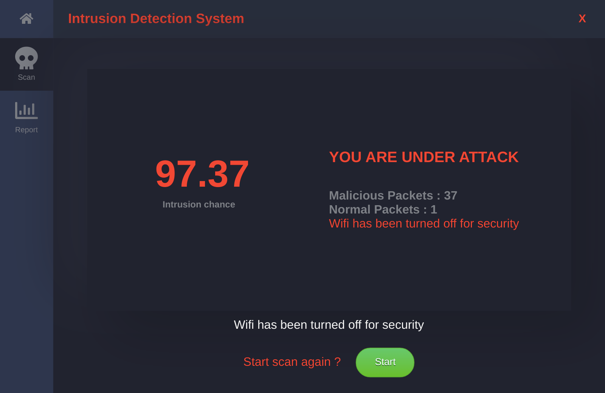

# Intrusion Detection System
This is a electron application that capture the live network traffic data and then tells whether there is a flow of some malicious packets that might be termed as an intrusion

## Screenshots
Home Screen

Scanning Screen

Intrusion Detected

Report Screen

## Dependencies
The project is build using electron and react for the user interface and for packet capturing and classification python is used. Below is the list of dependencis this project depends upon
* tshark (command line tool of wireshark)
* zenity (comes preinstalled in Gnome deskop environments)
* Electron and React
* Python modules (can be found in `src/python/requirements.txt`)

## Steps to Run
* Install all the dependencies
* Run `npm install`
* Install python dependencies 
    * `cd ./src/python`
    * `pip install`
* Run react server `npm run react`
* Add sudo password in environment variable. 
    * `export sudopassword="your_super_user_password"`
* Start electron app. `npm run electron`